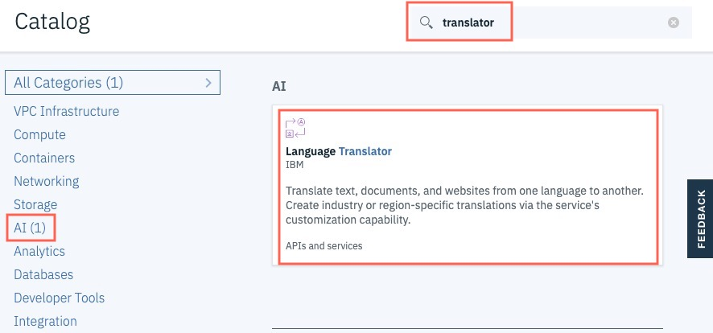
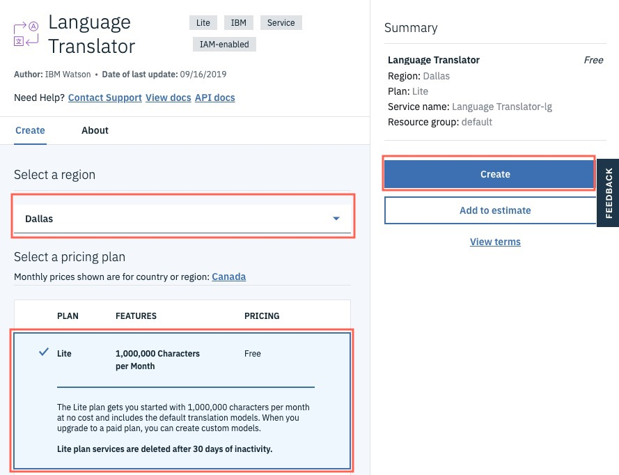
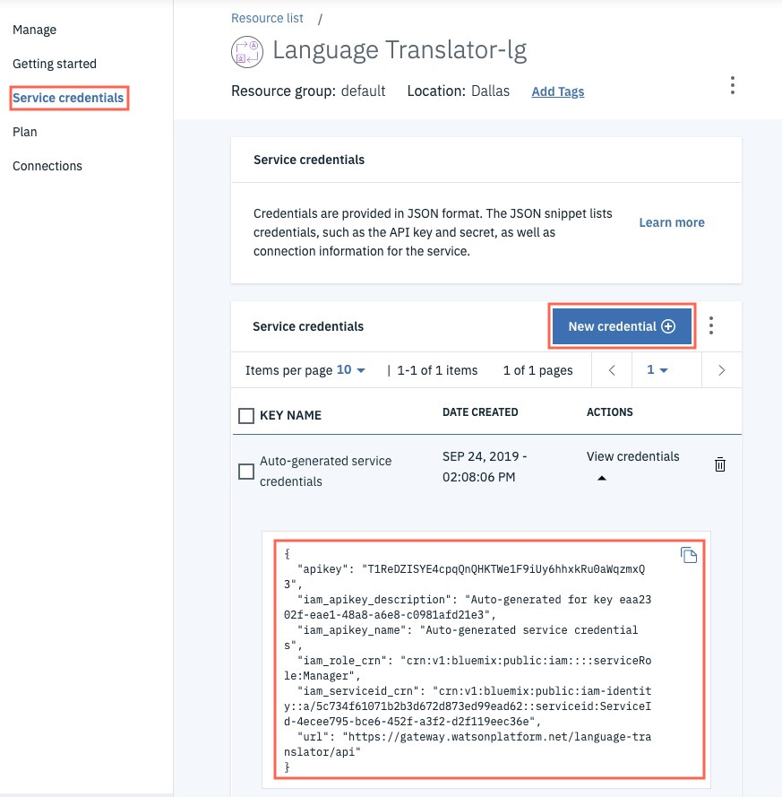

# Workshop for Containers Developer Summit
This workshop is an introduction to Docker, which is a runtime for containers. We will create a `containerized` Node.js application that provides a service to translate phrases from one language to another. The application uses the [IBM Language Transation service](https://www.ibm.com/watson/services/language-translator/).
## Environment
You can use one of the following environments for this workshop
1. Install `docker` locally using [Docker Desktop](https://www.docker.com/products/docker-desktop).
2. Use the web shell terminal provided to you at the workshop.

## Steps

### Step 1 - sign up on IBM Cloud
Sign up for IBM Cloud here: https://ibm.biz/containers-lab


### Step 2 - activate your account
Click on the link in the email you recieved from IBM to activate your cloud account. Make sure you check the spam folder in your email.
### Step 3 - create a language translation service
Log back into your IBM Cloud account using this URL: https://ibm.biz/containers-lab

Click on Catalog


Search `translator` to find the service. You can also find the service by navigating to the AI section on the left bar.



Click on the service to create a new instance. Pick the `Lite` plan on the next page and click `Create` to finish creating the service.



You will be redirected to the service landing page.
### Step 4 - copy the credentials to be used later
Click on `Service Credentials` on the left bar.



If you do not see a credential provided for you, you can create a new set of credentials. Save your `apikey` somewhere for the next section in this workshop.

**Congratulations!** You just signed up for IBM Cloud account and created your first `Language Translator` service. The next steps will show you how to build a Docker container for a Node.js application that provides an end point to translate text!

### Step 5 - clone repository
Open your local terminal or the web terminal provided in the workshop and clone this repository.
```
git clone https://github.com/lidderupk/nodejs-docker.git
```

### Step 6 - build the docker image
Change into the directory you just cloned and build the docker image
```
cd nodejs-docker
docker build -t <docker-username>/node-container .
```
The `docker-username` is required if you want to publish your image to [Dockerhub](https://hub.docker.com/).


Alternatively, you can also build directly from github using the following command without cloning the repository: 
```
docker build -t <docker-username>/node-container https://github.com/lidderupk/nodejs-docker.git
```

This command uses the [Dockerfile](./Dockerfile) to download a Node.js 10 base image and then install our Express.js application on top. Let's explore the contents of this docker file ...

```
FROM node:10
```
... builds our image on top of the Node.js 10 image.

```
WORKDIR /usr/src/app
```
... creates a working directory for our application to live in.

```
COPY package*.json ./
```
... copies the `package.json` file to our working directory.

```
RUN npm install
```
... install our dependencies. We just have two dependencies in this application: `express` and `ibm-watson`.

```
COPY . .
```
... copy the rest of our source code into the docker image

```
EXPOSE 8080
```
... expose port 8080. We will still have to forward our local port to this docker container port later.

```
CMD [ "node", "server.js" ]
```
... starts the application by running `node server.js`.

### Step 7 - run the docker image
```
docker run -p 8080:8080 -e "nlp_key=<api_key>" -d <docker-username>/node-container
```

In my case, I would run

```
docker run -p 8080:8080 -e "nlp_key=T1ReDZISYE4cpqQnQHKTWe1F9iUy6hhxkRu0aWqzmxQ3" -d upkar/node-container
```

### Step 8 - test the application
```
curl "localhost:8080?text=how%20are%20you"
```

You should see output as follows: 
```
{
  "translations": [
    {
      "translation": "¿Cómo estás?"
    }
  ],
  "word_count": 3,
  "character_count": 11
}%
```

The text is translated to Spanish `(en-sp)` by default. You can specify the langauge by passing in the lang flag as follows: 
```
curl "localhost:8080?text=how%20are%20you?&lang=en-de"
```

You should now see the same text translated to German:  
```
{
  "translations": [
    {
      "translation": "Wie geht es Ihnen?"
    }
  ],
  "word_count": 3,
  "character_count": 12
}
```

You can see the supported languages `(both from and to)` in the [Language Translator documentation](https://cloud.ibm.com/docs/services/language-translator?topic=language-translator-translation-models).

**How cool was that!** You just containerzied a Node.js application that provides transation services.